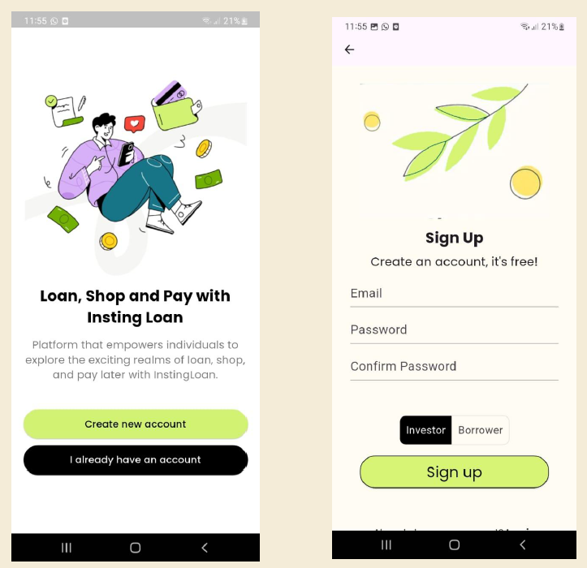
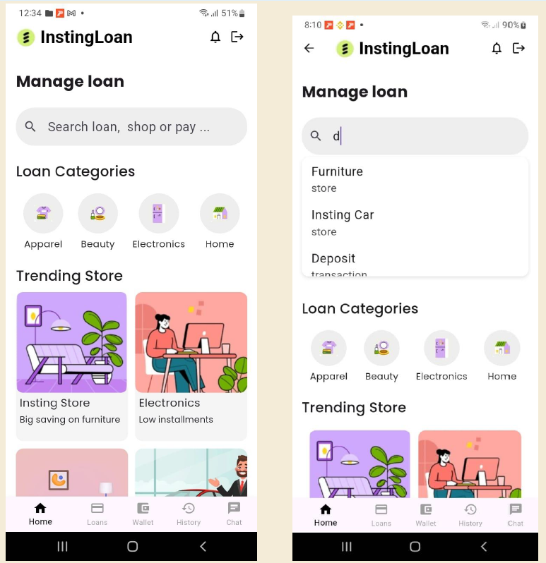
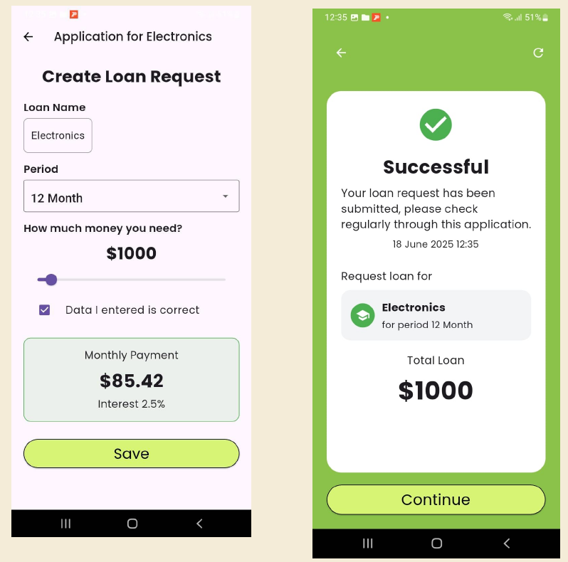
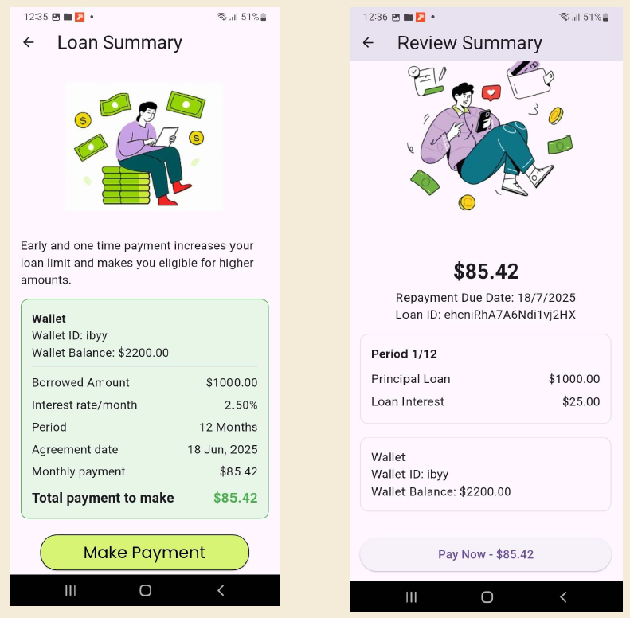
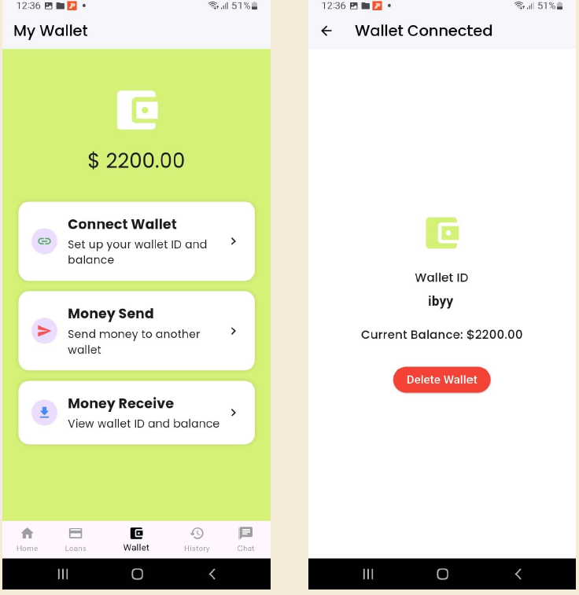
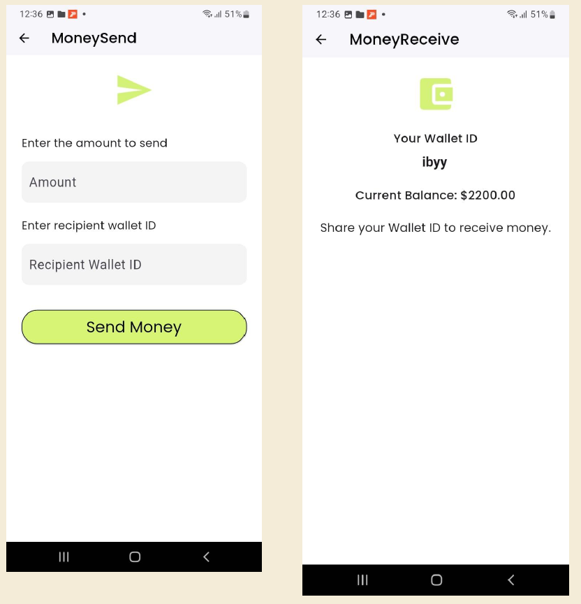
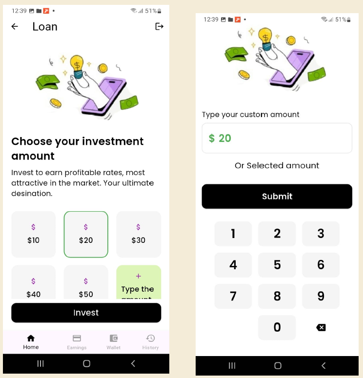
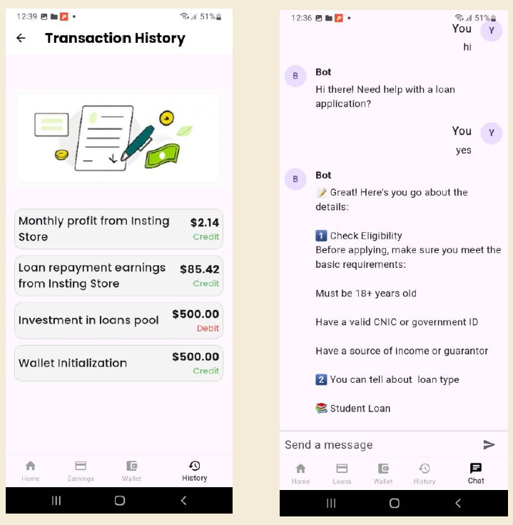

# 📱 InstingLoan

**InstingLoan** is a mobile application for managing personal **loans** and **investments**. The app offers two tailored experiences for users — **Borrowers** and **Investors**. It combines wallet-based transactions, real-time loan tracking, secure authentication, and AI-powered assistance, making it a complete micro-loan platform.

---

## 🖼️ App Screenshots

| Login/Register | Borrower Home | Loan Application | Loan Repayment |
|---------------|--------------|--------------|---------------------|
|  |  |  |  |

| Wallet | Send/Receive Money | Invest | History & Chatbot |
|--------------------|--------|---------|----------------|
|  |  |  |  |

---

## 🚀 Features

### 🔵 Borrower Module

- **Loan Application**
  - Browse and apply for loan options directly from the homepage.

- **Loan Status**
  - View approved and pending loans in separate, organized sections.

- **Search Functionality**
  - Real-time search for loans, with navigable results to detailed pages.

- **Wallet Integration**
  - Connect external wallets and send/receive money easily.

- **Transaction History**
  - Filtered and categorized records of all transactions.

- **Chatbot Assistance**
  - AI-powered chatbot using API for real-time loan support and guidance.

- **Firebase Authentication**
  - Secure sign-up and sign-in system with Firebase.

---

### 🟢 Investor Module

- **Sign Up / Sign In**
  - Secure access using Firebase Auth.

- **Wallet Setup**
  - Connect your wallet and initialize investment balance.

- **Investment in Loan Pool**
  - Invest in a central loan pool. Loans are auto-approved once the pool meets the requested amount.

- **Reward & Profit Dashboard**
  - View investment performance including ROI, total investment, and rewards.

- **Transaction History**
  - Full investment and earnings history with wallet-level detail.

---

## 🔐 Security & Tech Stack

- Flutter (Frontend)
- Firebase (Auth & Database)
- Google Wallet / MetaMask Integration
- REST API for AI Chatbot
- Secure Transaction Recording

---

> Built with ❤️ to simplify peer-to-peer micro-loan management.
